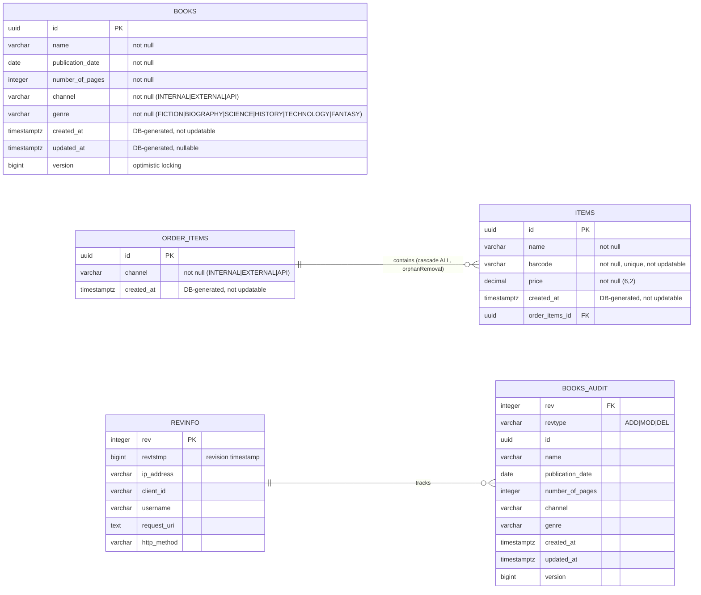

# Architecture Documentation — Spring Lessons

- [Overview](#overview)
- [Technology Stack](#technology-stack)
- [Project Structure](#project-structure)
- [Domain Model](#domain-model)
- [REST API](#rest-api)
- [Security](#security)
- [Kafka — Event-Driven Flow](#kafka--event-driven-flow)
- [Database](#database)
- [Audit Trail](#audit-trail)
- [Observability](#observability)
- [Email](#email)
- [SOAP Endpoint](#soap-endpoint)
- [Infrastructure](#infrastructure)
- [Architectural Patterns](#architectural-patterns)

---

## Overview

See [README.md](README.md) for a full project description.

The application exposes REST APIs for two domains — **Books** and **Items** — with asynchronous item processing through Kafka and a complete audit history via Hibernate Envers.

```text
┌─────────────────────────────────────────────────────┐
│                     Client                          │
└────────────────────┬────────────────────────────────┘
                     │ HTTP + JWT Bearer Token
                     ▼
┌─────────────────────────────────────────────────────┐
│           Spring Boot App  :8888                    │
│                                                     │
│  ┌──────────────┐      ┌──────────────────────┐     │
│  │ Books API    │      │ Items API            │     │
│  │ /v1/books    │      │ /v1/items            │     │
│  └──────┬───────┘      └──────────┬───────────┘     │
│         │                         │                  │
│  ┌──────▼───────┐      ┌──────────▼───────────┐     │
│  │ BooksService │      │ ItemsService         │     │
│  └──────┬───────┘      └──────────┬───────────┘     │
│         │                         │                  │
│         │              ┌──────────▼───────────┐     │
│         │              │ Kafka Producer        │     │
│         │              │ topic: topic-items   │     │
│         │              └──────────────────────┘     │
│         │                                            │
│  ┌──────▼───────────────────────────────────────┐   │
│  │              PostgreSQL (JPA + Envers)        │   │
│  │  schema: spring_app  |  audit: history       │   │
│  └───────────────────────────────────────────────┘  │
└─────────────────────────────────────────────────────┘
         ▲
         │ Kafka Consumer
         │ topic: topic-items
┌────────┴────────────────────────────────────────────┐
│              ItemsKafkaListener                     │
│   upload-items.group  |  delete-items.group         │
└─────────────────────────────────────────────────────┘
```

---

## Technology Stack

| Layer | Technology |
| --- | --- |
| Framework | Spring Boot 4.0.5 |
| Language | Java 25 |
| Web Server | Jetty (replaces Tomcat) |
| Security | Spring Security — OAuth2 Resource Server + JWT |
| Identity Provider | Keycloak |
| Database | PostgreSQL |
| ORM | Spring Data JPA + Hibernate |
| Audit | Hibernate Envers |
| DB Migrations | Flyway |
| Messaging | Apache Kafka |
| DTO Mapping | MapStruct 1.6.3 |
| API Documentation | OpenAPI 3 (SpringDoc — Swagger UI + Scalar) |
| Observability | Micrometer + OpenTelemetry + Prometheus + Grafana + Jaeger |
| Logging | Logback (JSON) + Loki |
| Email | JavaMail + Mailpit |
| HTTP Client | Apache HttpClient 5 |
| SOAP | Spring-WS + JAXB (XSD-generated) |
| Build | Maven |
| Code Quality | Spotless (Google Java Style) |
| SBOM | CycloneDX Maven Plugin |
| Containerization | Podman + Containerfile |

---

## Project Structure

```text
src/main/java/com/personal/springlessons/
├── controller/
│   ├── books/              # BooksRestController + IBooksRestController
│   ├── items/              # ItemsRestController + IItemsRestController
│   └── CommonRestControllerAdvice.java
├── service/
│   ├── books/              # BooksService
│   ├── items/              # ItemsService
│   └── email/              # EmailService
├── component/
│   ├── kafka/              # ItemsKafkaListener
│   │   └── filter/         # UploadItemsRecordFilter, DeleteItemsRecordFilter
│   ├── access/             # CustomAuthenticationEntryPoint, CustomAccessDeniedHandler
│   ├── mapper/             # MapStruct mappers (BookMapper, ItemsMapper)
│   ├── httpclient/         # AccountsClient (REST client)
│   ├── event/              # Spring Application Events
│   ├── interceptor/        # HTTP interceptors
│   └── filter/             # Servlet filters
├── config/
│   ├── SecurityConfig.java
│   ├── KafkaTopicsConfig.java
│   ├── AppPropertiesConfig.java
│   ├── RestClientConfig.java
│   └── ...
├── model/
│   ├── entity/
│   │   ├── books/          # BooksEntity
│   │   ├── items/          # ItemsEntity, OrderItemsEntity
│   │   └── revision/       # CustomRevisionEntity (Envers)
│   ├── dto/                # BookDTO, OrderItemsDTO, ItemDTO, ...
│   ├── lov/                # Channel, Genre, ItemStatus (enums)
│   └── csv/                # CSV models for import/export
├── repository/
│   ├── books/              # IBooksRepository
│   └── items/              # IItemsRepository, IOrderItemsRepository
├── endpoint/               # SOAP endpoint (PlatformHistoryEndpoint)
├── exception/              # Custom exception hierarchy
└── util/                   # Utility classes
```

---

## Domain Model

### Entities



> Schemas: `spring_app` → BOOKS, ORDER\_ITEMS, ITEMS &nbsp;|&nbsp; `history` → REVINFO, BOOKS\_AUDIT

**Unique constraint on BOOKS:** `(name, publication_date, number_of_pages)`

### Enums (List of Values)

| Enum | Values |
| --- | --- |
| `Channel` | INTERNAL, EXTERNAL, API |
| `Genre` | FICTION, BIOGRAPHY, SCIENCE, HISTORY, TECHNOLOGY, FANTASY |
| `ItemStatus` | UPLOAD, DELETE (used as Kafka message routing key) |

---

## REST API

Base path: `/spring-app` (configured via `spring.mvc.servlet.path`).
API version prefix: `/v1/`.

### Books API — `/v1/books`

| Method | Path | Scope | Description |
| --- | --- | --- | --- |
| GET | `/v1/books` | `books:get` | Retrieve all books. Returns 204 if empty |
| GET | `/v1/books/{id}` | `books:get` | Retrieve book by UUID |
| POST | `/v1/books` | `books:save` | Create a new book |
| PUT | `/v1/books/{id}` | `books:update` | Update book (requires `If-Match` header) |
| DELETE | `/v1/books/{id}` | `books:delete` | Delete book (requires `If-Match` header) |
| GET | `/v1/books/download` | `books:download` | Download all books as CSV |
| POST | `/v1/books/upload` | `books:upload` | Bulk import books from CSV (multipart/form-data) |

- PUT and DELETE use `If-Match` (ETag) for **optimistic concurrency control**.
- Each endpoint is annotated with `@Observed` for OpenTelemetry tracing.

### Items API — `/v1/items`

| Method | Path | Scope | Description |
| --- | --- | --- | --- |
| GET | `/v1/items` | `items:get` | Retrieve all orders with items (paginated) |
| POST | `/v1/items` | `items:upload` | Submit items for async processing (Kafka) |
| DELETE | `/v1/items` | `items:delete` | Request item deletion via Kafka |

- POST and DELETE publish a message to Kafka; actual DB persistence is asynchronous.
- GET supports Spring Data `Pageable` (page, size, sort).

### Exception Handling

Global `@RestControllerAdvice` maps exceptions to standard HTTP responses:

| Exception | HTTP Status |
| --- | --- |
| `InvalidUUIDException` | 400 Bad Request |
| `MethodArgumentNotValidException` | 400 Bad Request |
| `MissingRequestHeaderException` | 400 Bad Request |
| `ConstraintViolationException` | 400 Bad Request |
| `HttpMessageNotReadableException` | 400 Bad Request |
| `MethodArgumentTypeMismatchException` | 400 Bad Request |
| `BookNotFoundException` | 404 Not Found |
| `ConcurrentUpdateException` | 409 Conflict |
| `DuplicatedBookException` | 409 Conflict |
| `InvalidFileTypeException` | 400 Bad Request |
| `CSVContentValidationException` | 400 Bad Request |
| `SpringLessonsApplicationException` | 500 Internal Server Error |

---

## Security

**Strategy:** Stateless OAuth2 Resource Server. No sessions, no CSRF.

```text
Client ──── Bearer JWT ────► Spring Security Filter Chain
                                        │
                                        ▼
                             JWT validation (JWK endpoint)
                                        │
                              ┌─────────▼──────────┐
                              │   Keycloak realm   │
                              │ localhost:8080      │
                              └────────────────────┘
                                        │
                                  JWT claims extracted
                                        │
                              @PreAuthorize scope check
                              e.g. hasAuthority('SCOPE_books:get')
```

**Key configuration (`SecurityConfig.java`):**

- Session policy: `STATELESS`
- CSRF: disabled
- Authentication: `oauth2ResourceServer().jwt()`
- Method security: `@EnableMethodSecurity` → `@PreAuthorize` on every endpoint
- Custom handlers:
  - `CustomAuthenticationEntryPoint` → 401 responses
  - `CustomAccessDeniedHandler` → 403 responses
- `DefaultAuthenticationEventPublisher` for auth event propagation

**OAuth2 endpoints (Keycloak):**

- Issuer URI: `http://localhost:8080/realms/master`
- JWK Set URI: `http://localhost:8080/realms/master/protocol/openid-connect/certs`
- Token URL: `http://localhost:8080/realms/master/protocol/openid-connect/token`

### Roles × Scopes Matrix

| Scope | Type | `api-books-admin` | `api-books-writer` | `api-books-reader` | `api-items-admin` | `api-items-writer` | `api-items-reader` |
| --- | :-: | :-: | :-: | :-: | :-: | :-: | :-: |
| `books:get` | READ | X | X | X | | | |
| `books:download` | READ | X | X | X | | | |
| `books:save` | WRITE | X | X | | | | |
| `books:update` | WRITE | X | X | | | | |
| `books:upload` | WRITE | X | X | | | | |
| `books:delete` | DELETE | X | | | | | |
| `items:get` | READ | | | | X | X | X |
| `items:upload` | WRITE | | | | X | X | |
| `items:delete` | DELETE | | | | X | | |

### Client Applications × Roles Matrix

| Client Application | `api-books-admin` | `api-books-writer` | `api-books-reader` | `api-items-admin` | `api-items-writer` | `api-items-reader` |
| --- | :-: | :-: | :-: | :-: | :-: | :-: |
| `client-id-books-admin` | X | | | | | |
| `client-id-books-writer` | | X | | | | |
| `client-id-books-reader` | | | X | | | |
| `client-id-items-admin` | | | | X | | |
| `client-id-items-writer` | | | | | X | |
| `client-id-items-reader` | | | | | | X |

---

## Kafka — Event-Driven Flow

### Topic

- **Name:** `topic-items`
- **Message type:** `KafkaMessageItemDTO` (JSON serialized)
- **Routing key:** `ItemStatus` field (`UPLOAD` or `DELETE`)

### Producer Flow

```text
ItemsRestController
     │
     ▼
ItemsService.upload() / .delete()
     │
     ▼
KafkaTemplate.send("topic-items", KafkaMessageItemDTO)
     │
     ├── ItemStatus = UPLOAD  ──► OrderItemsDTO persisted
     └── ItemStatus = DELETE  ──► OrderItemsEntity deleted
```

### Consumer — ItemsKafkaListener

Two consumer groups share the same topic, each filtered to its own `ItemStatus`:

```text
topic-items
     │
     ├── uploadItemsRecordFilter (ItemStatus == UPLOAD)
     │        └── group: upload-items.group
     │                 └── ItemsKafkaListener.upload()
     │                          ├── Check barcode uniqueness
     │                          ├── Publish DuplicatedBarcodeEvent (if duplicate)
     │                          └── Save ItemsEntity → OrderItemsEntity
     │
     └── deleteItemsRecordFilter (ItemStatus == DELETE)
              └── group: delete-items.group
                       └── ItemsKafkaListener.delete()
                                ├── Remove ItemsEntity from order
                                └── Delete OrderItemsEntity if empty (orphan removal)
```

**Reliability settings:**

| Setting | Value |
| --- | --- |
| `enable-auto-commit` | false (manual ack) |
| `max-poll-records` | 1 (one record per poll) |
| `auto-offset-reset` | earliest |
| `@RetryableTopic(attempts)` | 1 |
| `dltStrategy` | NO_DLT |
| `concurrency` | 1 |

**Tracing:** each listener creates a Micrometer `Span` (`process-kafka-upload`, `process-kafka-delete`) with tags (`barcode`, `id_items`, `id_order_items`).

---

## Database

**Engine:** PostgreSQL  
**Connection:** `jdbc:postgresql://localhost:5432/spring`

### Schema Layout

| Schema | Purpose |
| --- | --- |
| `spring_app` | Application tables (books, items, order_items) |
| `history` | Envers audit tables (books_audit, revinfo) |
| `flyway` | Flyway migration metadata |

### Flyway Migrations

Managed via `spring.flyway.*`. Scripts live in `src/main/resources/db/`.

| Setting | Value |
| --- | --- |
| Default schema | flyway |
| App schema | spring_app |
| DDL auto | validate (no auto DDL) |
| Connect retries | 3 (interval 10s) |

### JPA Settings

| Setting | Value |
| --- | --- |
| Default schema | spring_app |
| Batch size | 1000 |
| Fetch size | 1000 |
| DDL auto | validate |

---

## Audit Trail

Implemented with **Hibernate Envers** (`@Audited`).

Currently audited entities: `BooksEntity`.

**How it works:**

1. Every INSERT / UPDATE / DELETE on `spring_app.books` creates a revision record in `history.revinfo`.
2. The corresponding snapshot is stored in `history.books_audit`.
3. `CustomRevisionEntity` enriches each revision with request metadata (IP, OAuth2 client, username, URI, HTTP method) captured by `CustomRevisionEntityListener`.

```text
HTTP Request
     │
     ├── (IP, clientId, username, requestUri, method)
     │            captured by CustomRevisionEntityListener
     ▼
history.revinfo       ──────  history.books_audit
(rev, revtstmp,              (rev, revtype, book fields...)
 ipAddress, clientId,
 username, requestUri,
 httpMethod)
```

Setting `store_data_at_delete = true` ensures book data is preserved even after deletion.

---

## Observability

Full three-pillar observability (metrics, traces, logs) via OpenTelemetry.

### Architecture

```text
Spring App
│
├── Micrometer Observations (@Observed, Spans)
│         │
│         ▼
│   OpenTelemetry SDK
│         │
│         ▼
│   OTLP Collector  (localhost:4318)
│         │
│         ├── Traces  ──► Jaeger     (localhost:16686)
│         ├── Metrics ──► Prometheus (localhost:9090)
│         │                    └──► Grafana (localhost:3000)
│         └── Logs   ──► Loki       (localhost:3100)
│                              └──► Grafana (localhost:3000)
│
└── /actuator/prometheus (localhost:8889)
          └──► Prometheus scrape
```

### OTLP Endpoints

| Signal | Endpoint |
| --- | --- |
| Metrics | `http://localhost:4318/v1/metrics` |
| Traces | `http://localhost:4318/v1/traces` |
| Logs | `http://localhost:4318/v1/logs` |

**Tracing sampling probability:** 100% (`management.tracing.sampling.probability=1.0`)  
**Metrics export interval:** 10 seconds

### Actuator

Management port: `8889` (separate from application port `8888`).

Exposed endpoints: `info`, `beans`, `env`, `health`, `metrics`, `prometheus`, `sbom`, `mappings`, `scalar`.

Health groups: `liveness` and `readiness` (Kubernetes-ready).

---

## Email

**Library:** JavaMail  
**Local SMTP server:** Mailpit (captures outgoing emails for development inspection)

| Setting | Value |
| --- | --- |
| Host | localhost |
| SMTP port | 1025 |
| UI | <http://localhost:8025> |
| POP3 port | 1026 |
| Prometheus (Mailpit) | localhost:9091 |

Email sending is handled by `EmailService`. Events (e.g., `DuplicatedBarcodeEvent`) can trigger notification emails.

---

## SOAP Endpoint

A SOAP web service endpoint (`PlatformHistoryEndpoint`) is exposed alongside the REST APIs.

- **Schema:** `src/main/resources/schemas/PlatformHistory.xsd`
- **Binding:** JAXB classes generated at build time from the XSD via `jaxb2-maven-plugin`
- **Framework:** Spring-WS

---

## Infrastructure

All external services run as containers via Podman Compose (`collections/compose-env.yaml`).

### Services

| Service | Image | Port(s) | Role |
| --- | --- | --- | --- |
| `springdb` | postgres:latest | 5432 | Application database |
| `kafka` | apache/kafka:latest | 29092 | Message broker |
| `keycloak` | quay.io/keycloak/keycloak:latest | 8080 | OAuth2 / OIDC provider |
| `mailpit` | axllent/mailpit | 1025 (SMTP), 8025 (UI) | Email capture |
| `wiremock` | custom-wiremock | 9998, 9999 | HTTP API mocking |
| `otelcol` | otel/opentelemetry-collector | 4317, 4318 | Telemetry aggregator |
| `jaeger` | jaegertracing/jaeger | 16686 | Distributed tracing UI |
| `prometheus` | prom/prometheus | 9090 | Metrics storage |
| `grafana` | grafana/grafana-enterprise | 3000 | Metrics + logs dashboards |
| `loki` | grafana/loki | 3100 | Log aggregation |

**Network:** `spring-lessons` (bridge)

**Service dependency order:**

```text
kafka ◄── (independent)
keycloak ◄── (independent)
otelcol ◄── jaeger
prometheus ◄── otelcol
grafana ◄── prometheus, jaeger, loki, springdb
```

### Application Container

The application itself can be containerized via `Containerfile` (Podman).  
A separate `collections/compose-app.yaml` runs the app container alongside the environment.

---

## Architectural Patterns

| Pattern | Where applied |
| --- | --- |
| **REST API versioning** | URL prefix `/v1/` on all endpoints |
| **Event-driven (async)** | Items upload/delete via Kafka |
| **Spring Application Events** | `DuplicatedBarcodeEvent`, `DiscardedItemCsv` |
| **Optimistic locking** | `If-Match` ETag header + `@Version` on BooksEntity |
| **Audit trail** | Hibernate Envers on BooksEntity |
| **Method-level security** | `@PreAuthorize("hasAuthority('SCOPE_*')")` |
| **Distributed tracing** | `@Observed` + manual Micrometer spans |
| **Structured exception handling** | `@RestControllerAdvice` hierarchy |
| **DTO separation** | MapStruct mappers, no entities exposed directly |
| **Stateless API** | No sessions, JWT on every request |
| **Graceful shutdown** | `server.shutdown=graceful` with 20s timeout |
| **CSV bulk import/export** | Books upload/download endpoints |
| **Message filtering** | Kafka `RecordFilterStrategy` per consumer group |
